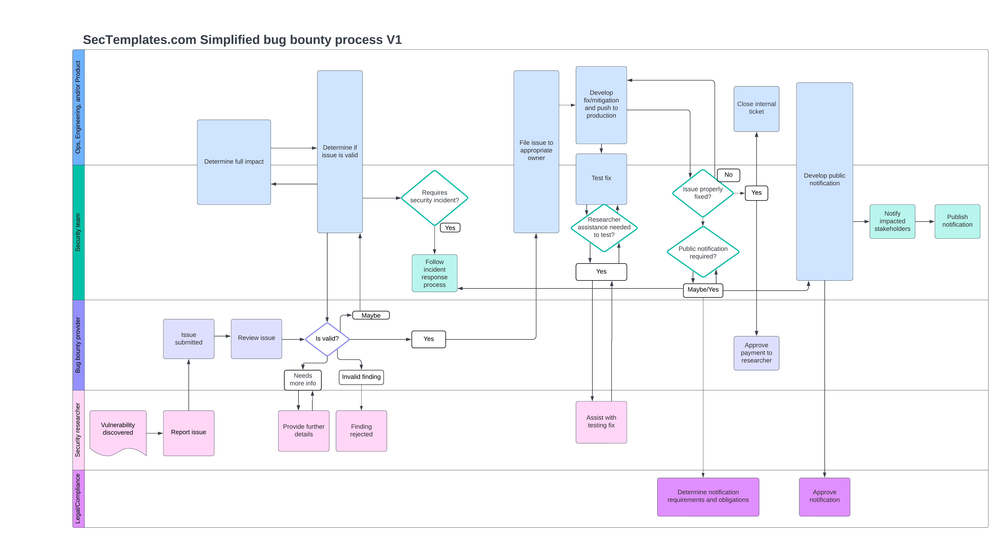

# Introduction to the Bug Bounty Program Pack
The goal of this release is to provide you with everything you need to establish a bug bounty program. This includes alignment with stakeholders, working with a vendor, establishing a private bug bounty, and ultimately moving to a public bug bounty. This release pack is not sponsored or influenced by any particular bug bounty vendor and is neutral to vendor biases and influence.
  
&#45; Robert Auger (<a href="https://x.com/robertauger">@robertauger</a>)  
It is recommended to review the material in the order specified below.

# 1. Bug Bounty Preparation Checklist
This checklist provides every step required to research, pilot, test, roll out, and expand a bug bounty program at your company.

# 2. Bug Bounty Reporting Requirements 
This document outlines the required information you'll need from a security researcher or vulnerability reporter as part of a bug bounty program.

# 3. Bug Bounty Policy
This document contains a sample bug bounty policy that you can copy, adjust, and publish on your site. <b>It is strongly encouraged that you review this with your legal team prior to publication</b>.

# 4. Bug Bounty Submission Response Templates 
This document provides copy/paste message/email templates that can be used to communicate with external security researchers for the most common scenarios.

# 5. Bug Bounty Process Workflows
This diagram outlines the various steps to perform once a bug bounty program is established and you start receiving vulnerability reports. From verifying the issue to pulling in stakeholders for support, managing incidents, and public notifications. It aligns roughly with the context in the bug bounty checklist.  

# 6. Bug Bounty Runbook 
A runbook the security team can use to ensure consistent steps are followed when a vulnerability report is received.

# 7. Bug Bounty Metrics
This file contains sample, baseline metrics for tracking your bug bounty program and reporting on it internally.

# Bug Bounty Frequently Asked Questions

<b>Question:</b> Do you recommend using a particular bug bounty provider? 
<b>Answer: </b> No, the goal of this pack is to be vendor-neutral and not lean towards one provider over another. Before selecting a vendor, you should perform a bake-off to determine which vendor works best for your situation. 
  

<b>Question:</b> Why do you recommend starting with a private bug bounty instead of going public? 
<b>Answer: </b> The main reason is to test your internal processes for handling externally reported issues, verify that your budget can support a wider-scoped program, and ensure the experience for the researchers is positive. Increase the scope based on your best judgment and ensure your company is prepared for handling a possible influx of issues a public program may bring.
  
<b>Question:</b> What is the license for this? 
<b>Answer: </b> This program pack utilizes a modified version of Creative Commons Attribution-NonCommercial 4.0 International. Specific modifications can be found under 'Custom Addendum for Commercial Packaging'.

Document version 1.0 copied from [Sectemplates.com](https://www.sectemplates.com)
