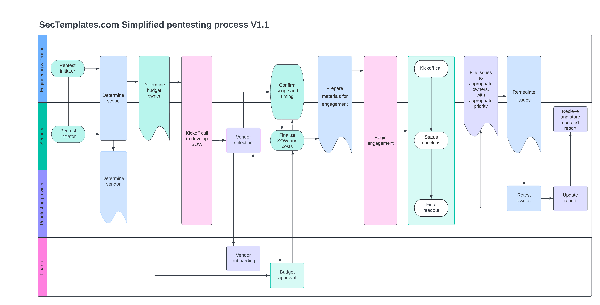

# Introduction to the external penetration testing program pack 1.1
Welcome to the penetration testing release pack, this release contains everything you need to scope your first pentest, work with a vendor, execute, and get the types of reports you need from an external tester. This will enable you to perform your first product or infrastructure level penetration test, and provide you with a process moving forward for future engagements.
  
We suggest reviewing the material in the order specified below.

# 1. Penetration testing preparation checklist
This <a href="./Pentesting_preparation_checklist.md">checklist</a> outlines everything you need to scope and perform a penetration test.

# 2. Penetration testing reporting requirements
This <a href="./Pentest_reporting_requirements.md">document</a> provides a list of minimal requirements that should be contained within a penetration testing report.  Before finalizing a SOW with the vendor, look here first.

# 3. Penetration testing process workflow
Below is an outline of a <a href="./Simplified_pentest_process.png">simplified pentesting process</a> with an external tester. It aligns roughly with the content in the penetration testing checklist.

# Penetration testing frequently asked questions
<b>Question:</b> Why didn't you include a sample report template? 
<b>Answer: </b> Each pentesting company has their own reporting template, and most have sample reports available to share. Instead of providing a template, we recommended you review the <a href="./Pentest_reporting_requirements.md">reporting requirements section</a>, determine what minimal information you want included, then contact your pentest provider and ensure these requirements are included in their final deliverables. 
  
<b>Question:</b> What software did you use to create the process diagram? 
<b>Answer: </b> Lucidchart was used. 
  
<b>Question:</b> Why should I use this instead of chatgpt or other AI? 
<b>Answer:</b> Material released on Sectemplates has been battle tested in various companies ranging from 100-30,000 employees successfully, and has been vetted by individuals developing and running these programs. AI can confuse standards, articles written by people who have never run such a program, and opinion pieces. Everything in Sectemplates has actually been utilized in the real world by qualified professionals. 
  
<b>Question:</b> You seem to be missing something and I'd like to suggest a modification. How can I reach out to you? 
<b>Answer: </b> Please use the <a href="https://www.sectemplates.com/contact-us.html">contact us form on our main website</a>.

Document version 1.1 copied from [Sectemplates.com](https://www.sectemplates.com)
