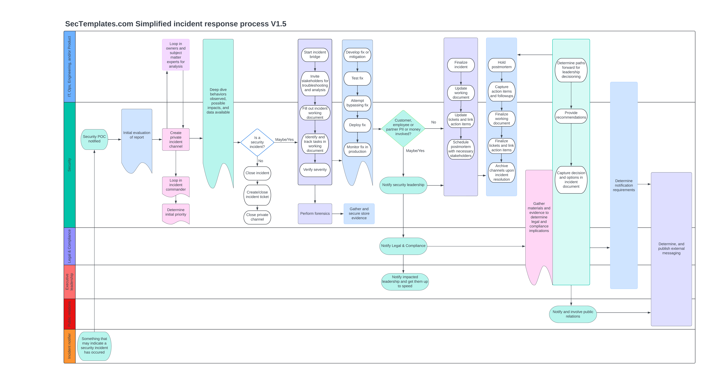

# Introduction to the incident response release pack 1.0
Welcome to the incident response release pack, the goal of this release is to provide you with everything you'd need to establish a functioning security incident response program at your company. 
  
We suggest reviewing the material in the order specified below

# 1. Incident response definitions and severity levels
This document introduces you to sample terminology and roles during an incident, the various stakeholders who may need to be pulled in to support an incident, and sample incident severity rankings.

# 2. Incident response preparation checklist
This checklist provides you with every step required to research, pilot, test, and rollout a functioning incident response program. 

# 3. Incident response workflow
Below is an outline of a simplified incident response process. It aligns roughly with the content in the incident response runbook.  

# 4. Incident response runbook
This runbook outlines the process a security team can use to ensure the right steps are followed during an incident, in a consistent manner.

# 5. Incident response working document template
This template is the primary working document for capturing all details of an incident. 

# 6. Incident postmortem/retrospective template
After a security incident, it's important to have a look back with key stakeholders to evaluate
* What went well
* What went 'ok'
* What went poorly
* Action items/follow ups to improve efficiencies moving forward 

Scheduling a postmortem meeting with core incident stakeholders, and using this document to capture the outcomes will provide a complete view of how the incident was handled. This enables your organization to have reduced difficulty in future incidents, and provides an opportunity to learn and course correct along the way. It is strongly recommended you take the 'blameless' postmortem approach which focuses less on personal mistakes, and more on root causes of mistakes and correcting them moving forward. This encourages people to speak up and be more honest about the situation, saving time, uncovering information, and reducing people afraid to participate. 

# 7. Samples folder
This contains filled out examples of both the incident response working document, and postmortem templates to give you an idea of what the end product can look like. 

# 8. Incident response metrics
This contains common, useful metrics for measuring an incident response program. 

# Incident response frequently asked questions
<b>Question:</b> What software did you use to create the process diagram? 
<b>Answer: </b> Lucidchart was used. 
  
<b>Question:</b> Why should I use this instead of chatgpt or other AI? 
<b>Answer:</b> Material released on Sectemplates has been battle tested in various companies ranging from 100-30,000 employees successfully, and has been vetted by individuals developing and running these programs. AI can confuse standards, articles written by people who have never run such a program, and opinion pieces. Everything in Sectemplates has actually been utilized in the real world by qualified professionals. 
  
<b>Question:</b> You seem to be missing something and I'd like to suggest a modification. How can I reach out to you? 
<b>Answer: </b> Please use the <a href="https://www.sectemplates.com/contact-us.html">contact us form on our main website</a>.

Document version 1.0 copied from [Sectemplates.com](https://www.sectemplates.com)
