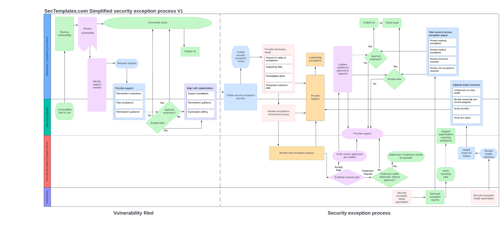

# Security Exception Program Pack

# About
Welcome to the Security Exception Program Pack. The goal of this release is to provide all the necessary resources to establish and set up a fully functioning security exceptions program at your company. We recommend reviewing the material in the order specified below.

# 1. Security exception definitions
This <a href="./Security_exceptions_definitions.md">document</a> describes common terminology used in an exceptions process, outlines definitions for the various stakeholders participating in the process, as well as provides a stakeholder approval table for decision making.

# 2. Security exception reporting requirements
This <a href="./Security_exception_reporting_requirements.md">document</a> describes the minimal information needed in a vulnerability report to support evaluation and prioritization. It also includes examples of automation that can be used to report vulnerability remediation expectations to risk owners.

# 3. Security exception program preparation checklist
This <a href="./Security_Exception_preparation_checklist.md">checklist</a> provides a step-by-step guide to researching, piloting, testing, and rolling out security exception tracking at your company. It also discusses examples of automation for tracking exception ticket health and oversight.

# 4. Security exception process
This diagram outlines the various steps to perform when 
  * Security Exceptions have been filed
  * Reporting automation runs
  * Ticket health automation runs
  

# 5. Security exception runbooks
This <a href="./Security_exception_runbooks.md">runbook</a> contains the steps outlined in the process diagram as a checklist with a strong focus on stakeholder support.

# 6. Security exception document template and tracker
The <a href="./Security_exception_template.md">security exception template</a> can be used in a word document for capturing exception details, and the <a href="./Security_exceptions_tracker.csv">Exception tracker</a> can be used when a bug tracker is not used.

# 7. Security exception metrics
This <a href="./Security_exceptions_metrics.md">document</a> outlines common, baseline metrics for managing security exceptions at your company.

# Frequenty Asked Questions
<b>Question:</b> Do I need to have a <a href="https://www.sectemplates.com/2024/08/announcing-the-vulnerability-management-program-pack-10.html">vulnerability management program</a> in place prior to using this program pack? 
<b>Answer: </b> No, however, it is strongly recommended that you have some form of vulnerability management program in place, as they integrate with each other and are complementary. Additionally, it simplifies the reuse of the risk ranking system within a VM program for an exceptions program.

<b>Question:</b> Why didn't you provide .doc files for the templates and registrar? 
<b>Answer: </b> You should always be cautious when downloading Word documents online, as they may contain malicious scripts that could compromise your system. Most security professionals avoid downloading random Word documents, so for this reason, I've opted to publish these in a format that can be easily copied and pasted.

<b>Question:</b> Was AI used to create this content? 
<b>Answer: </b> No, AI was only used for spelling and grammar improvements. All content was manually created by a person.
  
<b>Question:</b> What software did you use to create the process diagram? 
<b>Answer: </b> Lucidchart was used. 

Document version 1.0 copied from [Sectemplates.com](https://www.sectemplates.com/) 2024
