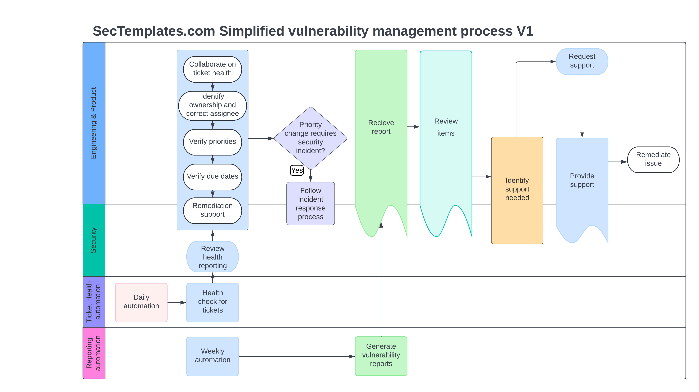

# Introduction to the Vulnerability Management Program Pack v1.1
Welcome to the Vulnerability Management Program Pack. The goal of this release is to provide all the necessary resources to establish and set up a fully functioning vulnerability management program at your company. We recommend reviewing the material in the order specified below.

# 1. Vulnerability management definitions and sample remediation SLAs 
This <a href="./Vulnerability_management_definitions.md">document</a> outlines vulnerability severity levels to help your company consistently evaluate and prioritize discovered issues. It also provides standard remediation SLAs as a baseline for setting remediation expectations.

# 2. Vulnerability reporting requirements
This <a href="./Vulnerability_reporting_requirements.md">document</a> describes the minimal information needed in a vulnerability report to support evaluation and prioritization. It also includes examples of automation that can be used to report vulnerability remediation expectations to risk owners.

# 3. Vulnerability program preparation checklist
This <a href="./Vulnerability_management_preparation_checklist.md">checklist</a> provides a step-by-step guide to researching, piloting, testing, and rolling out vulnerability tracking at your company. It also discusses examples of automation for tracking vulnerability ticket health and oversight.

# 4. Vulnerability management process
This diagram outlines the various steps to perform when automation runs, ensuring stakeholders are well-supported and ticket health is properly managed. It aligns with the content in the Vulnerability Program Preparation Checklist.

# 5. Vulnerability management runbook
This <a href="./Vulnerability_management_runbook.md">runbook</a> contains the steps outlined in the process diagram as a checklist, with a strong focus on ticket health oversight and stakeholder support.

# 6. Vulnerability management metrics
This <a href="./Vulnerability_management_metrics.md">document</a> outlines common, baseline metrics for managing vulnerabilities at your company.

# 7. Updates
This <a href="./UPDATES.md">file</a> contains update information for this release pack. 

# Vulnerability managment Frequenty Asked Questions

<b>Question:</b> This program pack focuses on addressing issues after they are discovered. Why didn't you include vulnerability identification as part of vulnerability management? 
<b>Answer: </b> The technical skill sets required for vulnerability identification typically differ from those needed for managing risk in a vulnerability or risk management program. Typically, a technical program manager oversees all aspects of vulnerability risk, escalates issues, and brings in subject matter experts when necessary. In contrast, a security engineer focuses on scanning requirements, mitigation guidance, scanning types (.e.g SAST/DAST/etc), integrations, scanning configurations, scanner health, and coverage expansion. For this reason, vulnerability identification was not included in this vulnerability management program pack. However, it may be addressed in its own program pack in the future if there is sufficient demand
  
<b>Question:</b> Was AI used to create this content? 
<b>Answer: </b> No, AI was only used for spelling and grammar improvements. All content was manually created by a person.
  
<b>Question:</b> Why should I use this instead of chatgpt or other AI? 
<b>Answer:</b> Material released on Sectemplates has been battle-tested in various companies ranging from 100 to 30,000 employees successfully and has been vetted by individuals developing and running these programs. AI can confuse standards, articles written by people who have never run such a program, and opinion pieces. Everything in Sectemplates has actually been utilized in the real world by qualified professionals.
  
<b>Question:</b> What software did you use to create the process diagram? 
<b>Answer: </b> Lucidchart was used. 

Document version 1.0 copied from [Sectemplates.com](https://www.sectemplates.com) 2024
